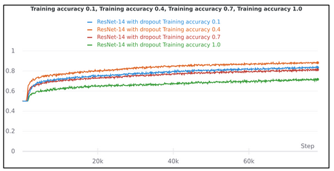

# Jointly Matching and Completion of Non-Rigid Partial Data

The repo contains the code developed by my teammate and me as a part of our praktikum for "Tracking and Detection for Computer Vision".

# Introduction
Recently, with the rapid development of computation power, learning-based methods have beaten hand-crafted ones by a large margin. However, existing learning-based methods do it either on a whole mesh or only consider rigidly transformed objects. In this project, differing from previous ones, we conducted our project on a non-rigid and partial setting to fill the aforementioned gap. 

# Approach
1. Due to the lack of real data fitting our project properly, the first step was to use a dataset of non-rigidly deforming human bodies shapes to obtain training data.
2. Camera trajectories were generated and virtual scan was done to introduce rigid tranformation and obtain partial data.
3. Design of network archictectures.

# Tasks
1. Prepare human body dataset with known correspondences (provided by the tutor)
2. Detect keypoints on each model and establish correspondences among different deformed models
3. Generate camera trajectories and do virtual scan to introduce rigid transformation and obtain partial data
4. Design network architectures with completion proxy to learn embedding on obtained non-rigid partial data
5. Do visualizing work on both processed data and learned results
6. Finish ablation studies below:
    - with the same network, conducting experiments on dataset: a) with only rigid transformation, b) with
      both rigid transformation and non-rigid deformation
    - on the same dataset but with different networks: a) w/o completion proxy, b) with completion proxy
    - on the same dataset with the same network but using different embedding learning losses.
    
# Results
The following figure consists the camera positions generated around the human body dataset consisting of keypoints to establish correspondeces among different deformed models and to do virtual scan.
<h2 align = "center">
    
</h2>

The figure below shows the non - rigid partial data obtained as a TSDF representation.
<h2 align = "center">
    
</h2>
Below are the training and validations loss curves and accuracy curves for threshold values of 0.1,0.4,0.7 and 1.0 for a neural network without completion proxy.
<h2 align = "center">
    
</h2>
<h2 align = "center">
    
</h2>

Below is the training and validation loss curves for a neural network with completion proxy.
<h2 align = "center">
    
</h2>

# References
1. Andy Zeng et al. “3DMatch: Learning Local Geometric Descriptors from RGB-D Reconstructions”. In: CVPR.2017.
2. Xiaolong Wang, Allan Jabri, and Alexei A Efros. “Learning correspondence from the cycle-consistency of time”.In: Proceedings of the IEEE Conference on Computer Vision and Pattern Recognition. 2019, pp. 2566–2576.
3. Hanyu Wang et al. “Learning 3d keypoint descriptors for non-rigid shape matching”. In: Proceedings of the European Conference on Computer Vision (ECCV). 2018, pp. 3–19.
4. Chun-Hao Huang et al. “A Bayesian Approach to Multi-view 4D Modeling”. In: International Journal of Computer Vision 116.2 (Jan. 2016), pp. 115–135. doi: 10.1007/s11263- 015- 0832- y. url: https://hal.inria.fr/hal-01211810.
